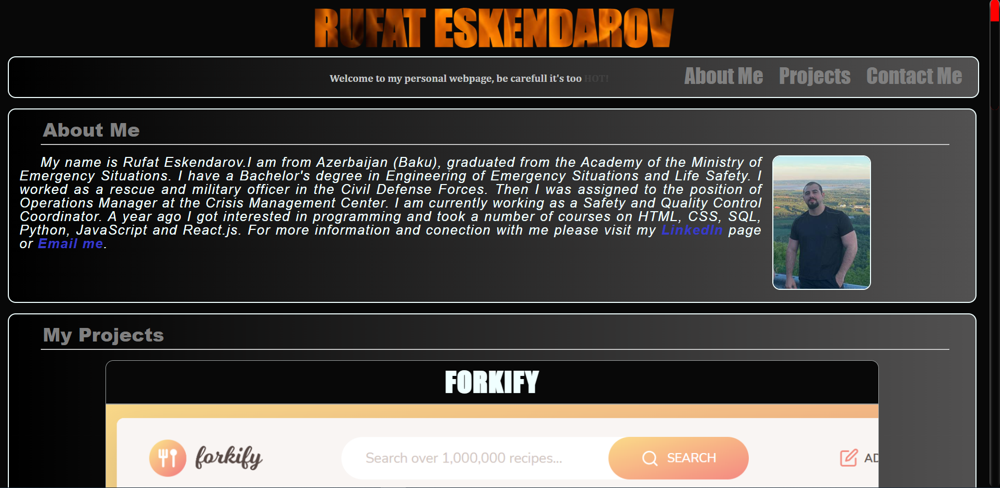

# My HOT WebPage(portfolio)

## Description

- This project was created to practice the knowledge gained in the course. 
- The project contains a short description of my projects, links to them and to the source code itself. 
- This project should allow a potential employer to understand my level of knowledge and the range of technologies that I own.

## Installation

This project was deployed via GitHub. Link:  https://rufateskendarov.github.io/Portfolio/
Also, if you want to review the components in more detail, go to my repository. Link: https://github.com/RufatEskendarov/Portfolio
No additional installation required

## Usage

This website is adapted for PC, Tablets and Smartphones.
Check out the screenshots below:
PC:
__________________________________________________________________________________________________________________________

## Credits

To animate the blinking text, a video tutorial from YouTube was used. Please see the link:https://www.youtube.com/watch?v=XeUfYYXeHgc

## License

In accordance with https://choosealicense.com/licenses/gpl-3.0/

## Features

- @media query
- CSS animation
- Semantic HTML 

## How to Contribute

Please review my page if you have ideas or advises please contact me (rufat.eskendarov@gmail.com)

## Tests

Adaptability tests were carried out on devices such as iPhone 12 Pro, Galaxy S8, iPad Air, etc.